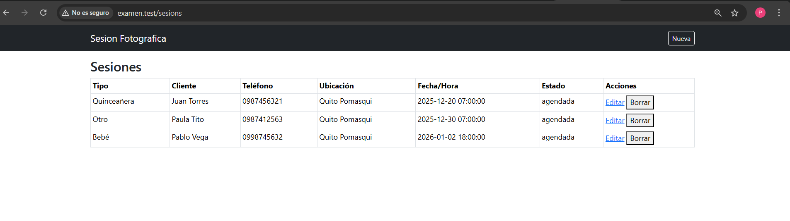
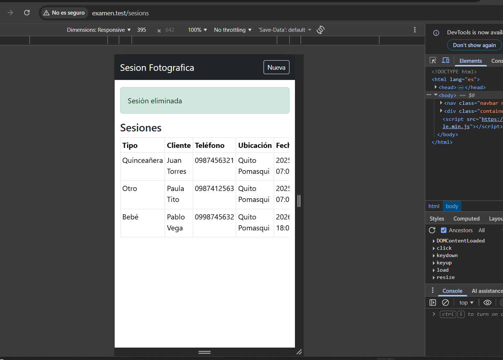

# Examen Práctico - Estudio Fotográfico
 
Estudiante: Daniela Pozo  
Fecha: 18/12/2025  

## Descripción
En este sistema se realizaron funciones para registrar y administrar sesiones fotográficas
como (bodas, quinceañeras, bebés, etc.).  
Permite agendar sesiones, editarlas, cambiar su estado y visualizarlas
desde un computador o celular.

---

## Decisiones de Diseño

### 1. Tabla principal
Nombre de la tabla: sesions

Campos:

<table>
  <tr>
    <th>Campo</th>
    <th>Tipo</th>
    <th>Obligatorio</th>
  </tr>
  <tr>
    <td>tipo_sesion</td>
    <td>string</td>
    <td>Sí</td>
  </tr>
  <tr>
    <td>cliente</td>
    <td>string</td>
    <td>Sí</td>
  </tr>
  <tr>
    <td>telefono</td>
    <td>string</td>
    <td>Sí</td>
  </tr>
  <tr>
    <td>ubicacion</td>
    <td>string</td>
    <td>Sí</td>
  </tr>
  <tr>
    <td>fecha_hora</td>
    <td>datetime</td>
    <td>Sí</td>
  </tr>
  <tr>
    <td>estado</td>
    <td>enum</td>
    <td>Sí</td>
  </tr>
  <tr>
    <td>created_at</td>
    <td>timestamp</td>
    <td>Sí</td>
  </tr>
  <tr>
    <td>updated_at</td>
    <td>timestamp</td>
    <td>Sí</td>
  </tr>
</table>

---

### 2. Estados definidos para las sesiones
- agendada
- realizada
- fotos_entregadas
- cancelada

---

### 3. ¿Se eliminan las sesiones?
Sí, porque se considera importante por si hubo un error con una sesión y se debe borrar.
Pero estoo no debería poderse con las sesiones donde las fotos ya fueron entregadas, ya que también
hay forma de mantenerlas como portafolio del estudio fotográfico según la sugerencia de lo que dijo el esposo,
y considero imoprtante para llevar un historial.

---

### 4. Fecha de agendamiento
La fecha en que se agenda la sesión usa un calendario para que sea más fácil. 
y se usa created at de laravel para que se registre.

---

## Link del repositorio Git

https://github.com/DaniellaPR/examen-desarrollo

---

## Capturas de Pantalla

### Listado de sesiones

### Formulario de sesión

### Vista móvil

*(Las demás imágenes en directorio de capturas)
